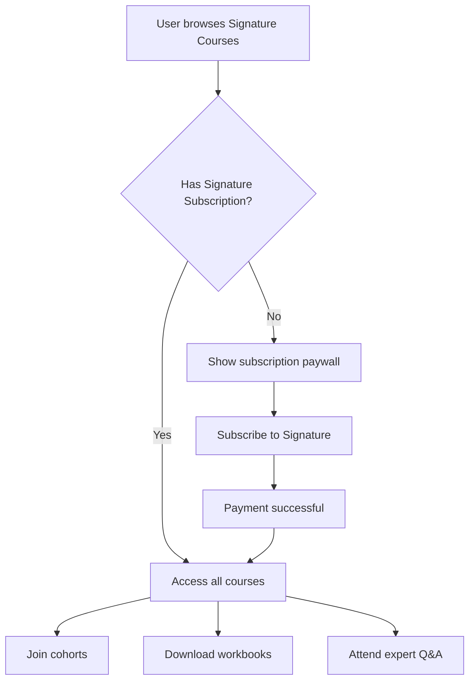

# Signature Courses - Subscription Model

## Overview
Based on the **Business Blueprint (Section 5: Monetization & Pricing)**, Signature Courses (Category B) follow a **SUBSCRIPTION model**, NOT individual course pricing.

## Pricing Structure

### Category A: All-Access Library
- **Model**: Single subscription unlocks entire library
- **Pricing**: Monthly/Annual subscription
- **Revenue**: Usage-based revenue share to creators (weighted by engagement)
- **Access**: All general courses

### Category B: Signature Courses ⭐
- **Model**: **Separate premium subscription**
- **Pricing**: 
  - **Monthly**: 499 EGP/month
  - **Annual**: 4,990 EGP/year (save 17%)
  - **Bundle A+B**: 699 EGP/month (both libraries)
- **Revenue**: Negotiated terms per program with creators
- **Access**: ALL signature courses, cohorts, workbooks, and expert Q&A

### Category C: Creator Membership Channels
- **Model**: Individual creator subscriptions
- **Pricing**: Set by creators (within platform ranges)
- **Revenue**: Net of platform fee + processing
- **Access**: Creator's private content and community

## Implementation Details

### Database Schema
```prisma
model Course {
  contentCategory  ContentCategory // CATEGORY_A | CATEGORY_B | CATEGORY_C
  price           Float?           // For display/legacy only
  // Category B courses don't use individual pricing
}

model Subscription {
  plan            SubscriptionPlan // ALL_ACCESS | SIGNATURE | BUNDLE | CREATOR
  status          SubscriptionStatus
  currentPeriodEnd DateTime
}
```

### User Experience

**For Category B (Signature Courses):**

1. **Discovery**: Browse all signature courses publicly
2. **Selection**: Click any signature course
3. **Paywall**: Prompted to subscribe to "Signature Subscription"
4. **Benefits**: 
   - Unlimited access to ALL signature courses
   - Weekly cohort sessions
   - Comprehensive workbooks
   - Expert Q&A sessions
   - Verified certificates
5. **Subscription Options**:
   - Signature only (499 EGP/month)
   - Bundle with All-Access (699 EGP/month)

**UI Indicators:**
- Crown icon 👑 on all signature course cards
- "Signature Subscription Required" badge
- No individual "Buy for X EGP" buttons
- "Subscribe to Access" CTA instead

## Key Differences from Category A

| Feature | Category A (All-Access) | Category B (Signature) |
|---------|------------------------|------------------------|
| **Submission** | Open (creator-submitted) | Invitation only |
| **Quality** | Content guidelines | Strict editorial review |
| **Production** | Creator-produced | High production value |
| **Learning** | Self-paced | Cohort-based + self-paced |
| **Resources** | Standard | Workbooks + resources |
| **Support** | Community | Expert Q&A + coaching |
| **Certificates** | Optional | Verified certificates |
| **Pricing** | Included in All-Access | Separate subscription |

## Revenue Distribution

### Category B Model:
```
Learner pays 499 EGP/month
├── Platform fee (30-40%)
├── Payment processing (2-3%)
└── Creator pool (57-68%)
    ├── Negotiated per-course deals
    ├── Possible minimum guarantees
    └── Bonus for top performers
```

### Creator Compensation Examples:
1. **Fixed + Revenue Share**: 10,000 EGP/month + 15% of attributed revenue
2. **Pure Revenue Share**: 60% of attributed watch time revenue
3. **Guaranteed Minimum**: Min 20,000 EGP/month or 50% revenue share (whichever higher)

## Subscription Flow



## Implementation Checklist

- [x] Remove individual pricing from signature course cards
- [x] Add "Subscription Required" badges
- [x] Display subscription pricing in hero (499 EGP/month)
- [x] Update course detail pages to show subscription CTA
- [ ] Build subscription checkout flow
- [ ] Implement subscription management
- [ ] Add subscription status checks
- [ ] Create cohort enrollment system
- [ ] Build workbook download system
- [ ] Integrate expert Q&A scheduling

## Future Enhancements

1. **Tiered Signature Plans**:
   - Basic: Access to courses only (399 EGP)
   - Premium: Courses + cohorts (499 EGP) ⭐ Current
   - Elite: Everything + 1:1 sessions (799 EGP)

2. **Annual Discount**: 
   - 4,990 EGP/year (2 months free)

3. **Corporate Plans**:
   - Team subscriptions with admin dashboard
   - Bulk pricing

4. **Student Verification**:
   - 50% discount with valid student ID
   - 249 EGP/month for students

## Migration Notes

**Existing Individual Prices:**
The `price` field in the database for Category B courses is kept for:
- Display purposes (shows course value)
- Legacy data
- Comparative marketing ("2,999 EGP value, included in subscription")

**Migration Path:**
1. Phase 1: Both models available (transition period)
2. Phase 2: Subscription only (current implementation)
3. Phase 3: Remove price field from Category B courses

## Related Files

- `/src/app/[locale]/signature-courses/page.tsx` - Course catalog with subscription badges
- `/src/app/api/signature-courses/route.ts` - API endpoint
- `/scripts/create-signature-courses.ts` - Seed data
- `/business_blueprint.md` - Section 5: Monetization model

## Questions & Answers

**Q: Can users buy individual signature courses?**
A: No. Signature courses require a monthly/annual subscription to access ALL courses.

**Q: What if a user only wants one course?**
A: They still need the subscription. The value is in accessing multiple high-quality courses for one price.

**Q: How is this different from Netflix?**
A: Exactly like Netflix - one subscription, unlimited content. Focus on creating great courses to maximize engagement.

**Q: What about refunds?**
A: Standard 7-day money-back guarantee on new subscriptions. Pro-rated refunds for cancellations.

**Q: Can creators offer their signature courses outside the platform?**
A: No. Signature courses are exclusive to the platform per creator agreement.
